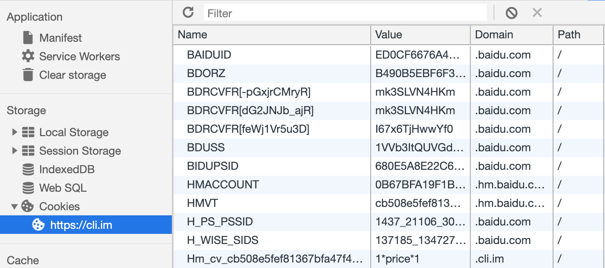

### What

- cookie 是以名值对形式储存于客户端的一段字符串
- cookie 的作用，是为了让服务端能够掌握某些针对单个客户端的持久化信息
- 单个 cookie 最大长度一般不超过 4kb，单个域名下 cookie 总数一般不超过 50 个，有些浏览器还会限制单个域名下 cookie 总容量。一般来说 cookie 总量不要超过 4kb。[参考](http://browsercookielimits.squawky.net/)

 

### 工作机制

同域内，浏览器发送的任何请求都会带上 cookie，cookie 设置于请求头中的 Cookie 字段

 

服务端可以通过响应头 Set-Cookie 设置 Cookie，客户端也能通过 `document.cookie` 读取非 httponly 的 cookie 以及设置 cookie

- document.cookie = xxx 可以设置一个 cookie，键值相同则覆盖，不同则新增
- document.cookie 返回所有 cookie 的键和值，并以 ; 号连接成字符串

 

### 组成

Cookie 是由键值对构成的字符串，其中有几个重要字段：
- [name]
- [value]
- [domain] 默认为当前域，用于限制客户端脚本读取 cookie 的权限
- [path] 默认为当前页面的路径，功能同上
- [expires] 未设置 expires => session cookie，储存于内存；设置了 expires => persistent cookie，储存于本地
- [httponly] httponly 默认值为 0，设为 1 表示仅存在于 http 层，客户端脚本无权读取
- [secure] 带有 secure 标识，表示该 cookie 仅用 https 传输

name 和 value 为必填，其余为选填

 

### Cookie 的局限

- cookie 只能储存单一格式的数据
- 单个域名下 cookie 总数有限，一般不超过 50 个
- 单个域名下 cookie 总大小有限，一般不超过 4kb
- 设置和操作 cookie 比较麻烦，需要自行封装方法
- 过度使用 cookie 会影响请求与响应的效率（可能出 413 问题）

 

### Third-Party Cookies

- first-party cookie：domain 和当前导航栏 domain 一致的 cookie
- third-party cookie：domain 和当前导航栏 domain 不一致的 cookie

当一个页面，发出了跨域请求，而该请求的响应包含了 Set-Cookie，那么此时设置的 cookie 就是 third-party cookie。比如请求 `https://hm.baidu.com/hm.js`，会响应 `Set-Cookie: HMVT=xxx; Path=/; Domain=hm.baidu.com`，这时就能在浏览器看到名为 HMVT 的 cookie

- 上述 domain 为 baidu.com 的 cookie 就是 third-party cookie
- 用 document.cookie 只能打印出 first-party cookie，也即 domain 为 cli.im 的 cookie
- 发送 cli.im 域名的请求，会带上 first-party cookie，而不会带 third-party cookie
- 发送 baidu.com 域名的请求，会带上 third-party cookie，而不会带 first-party cookie

 

### 参考

https://webkit.org/blog/7675/intelligent-tracking-prevention/

https://web.dev/samesite-cookies-explained/
